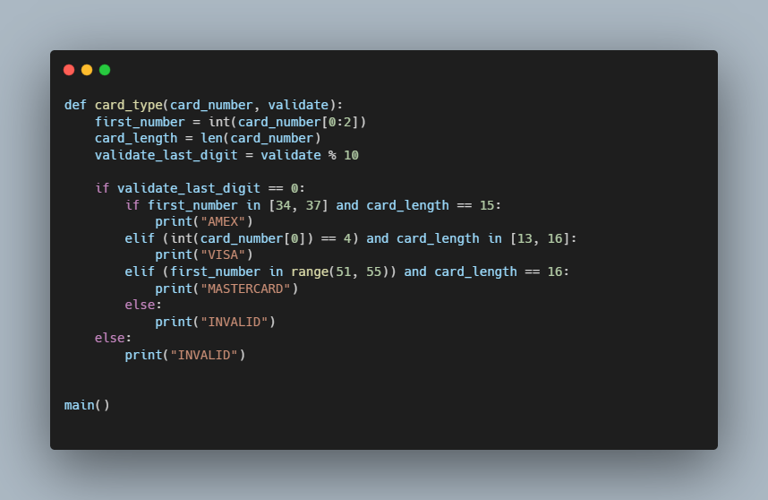

# Credit Python - CS50

### Description

A program that determines whether a provided credit card number is valid according to Luhn's algorithm.

In credit.py I have written a program that prompts the user for a credit card number and then 
reports via (print) wether it is a valid American Experess, MasterCard, or Visa card number.

### How to use

python credit.py 
Enter card number:

Receive confirmation of card type AMEX, MASTERCARD, VISA, INVALID

### Code Snippet

### Links

For more information about Filter-more visit: 

---------------------------------
[cs50 course](https://cs50.harvard.edu/x/2022/psets/6/credit/)
---------------------------------------------------------------

